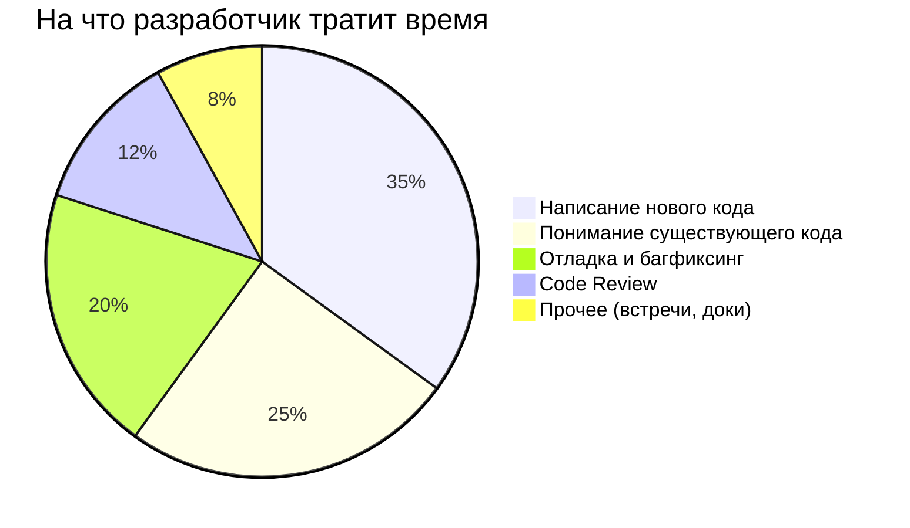
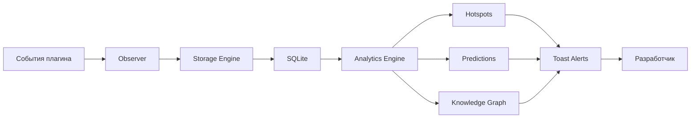
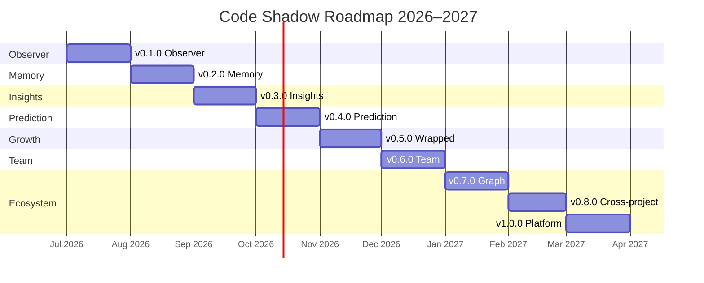
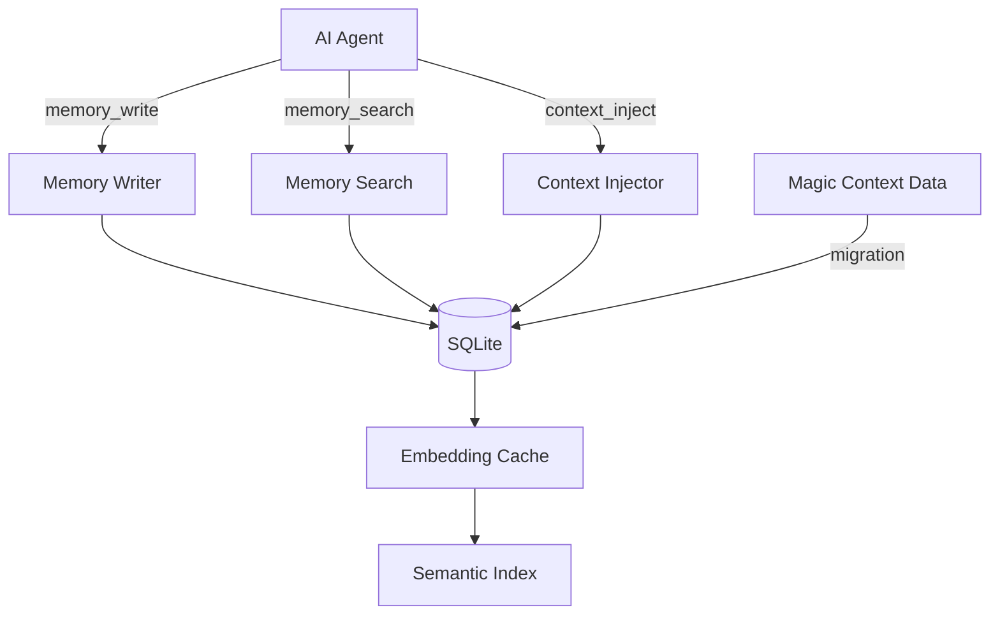
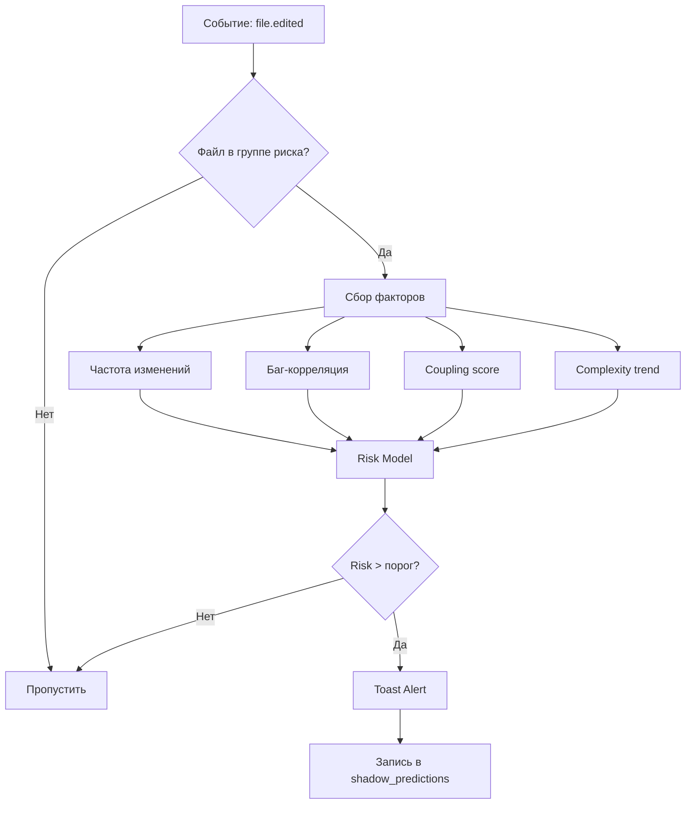
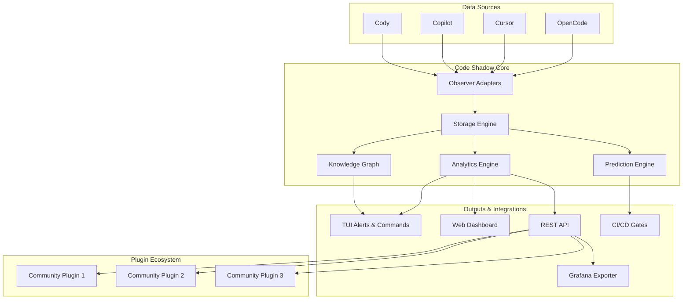
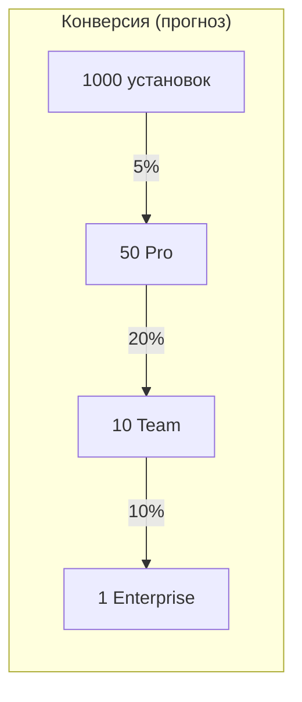
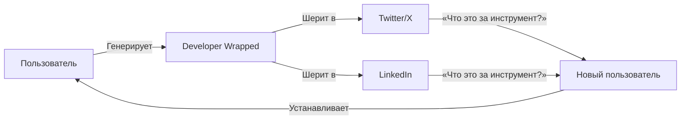
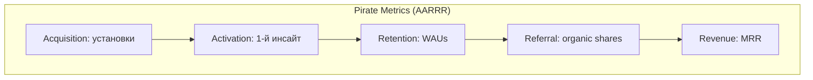
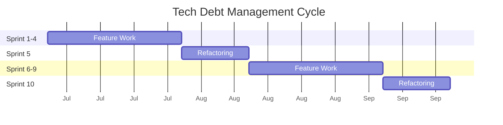

# 🗺️ ROADMAP — Code Shadow

**Последнее обновление**: 29 сентября 2026
**Актуальная версия исходного baseline**: v0.1.2

> Стратегическая дорожная карта не является чек-листом уже реализованных
> возможностей. Для текущей реализации см. [IMPLEMENTATION_STATUS.md](IMPLEMENTATION_STATUS.md).

---

## 1. Видение продукта

### Миссия

> **Сделать невидимое видимым. Превратить сырые данные о разработке в действенные инсайты.**

Code Shadow — это не просто ещё один плагин для сбора метрик. Это слой наблюдения
за процессом AI-ассистированной разработки, который отвечает на вопросы, которые
разработчики даже не догадывались задать.

### Видение будущего

Через 3 года Code Shadow станет стандартным слоем телеметрии для AI-разработки —
тем же, чем `git` стал для контроля версий, или `npm` для управления зависимостями.
Каждый AI-инструмент будет иметь Shadow-подобную аналитику, но Code Shadow останется
единственным независимым и кросс-платформенным решением.

### Целевая аудитория

| Сегмент | Портрет | Боль | Ценность Shadow |
|---|---|---|---|
| **Разработчик-одиночка** | Использует OpenCode/Cursor/Copilot ежедневно, пишет много кода | Не понимает, где теряет время, какие файлы самые проблемные | Персональная аналитика, Developer Wrapped, предикшн проблем |
| **Тимлид / Tech Lead** | Управляет командой 3–10 разработчиков, все используют AI | Не видит картину в целом: где команда буксует, какие модули требуют рефакторинга | Team Dashboard, health score, сравнительная аналитика |
| **CTO / VP Engineering** | Отвечает за технологическую стратегию, 20+ разработчиков | Нет количественных метрик качества AI-ассистированной разработки | Organization Dashboard, cross-project аналитика, ROI AI-инструментов |
| **Open-source maintainer** | Ведёт популярный репозиторий, получает много PR | Не понимает, какие части кода пугают контрибьюторов, где накапливается долг | Hotspot engine, граф зависимостей, health trends |

### Проблема



Разработчики тратят до **40% времени** на понимание существующего кода и отладку.
AI-инструменты ускоряют написание кода, но **ошибки тоже случаются быстрее**.
При этом не существует инструментов для **количественного анализа здоровья кодовой
базы** в контексте AI-ассистированной разработки.

**Парадокс AI-разработки**:
- Кода пишется в 2–3 раза больше
- Понимания того, что написано — меньше
- Технический долг накапливается быстрее
- **Никто не измеряет эти эффекты**

### Решение

Code Shadow — **автоматический наблюдатель**, который:

1. **Собирает** события разработки пассивно (zero-config, never crash)
2. **Анализирует** паттерны: hot files, coupling, complexity trends
3. **Предсказывает** проблемы до их возникновения: рискованные изменения, «запах» регрессий
4. **Интегрируется** глубоко с AI-ассистентом через тулзы и уведомления в реальном времени



---

## 2. Конкурентный анализ

### Competitive Landscape

| Инструмент | Сбор данных | Аналитика | Предикшн | AI-интеграция | Цена |
|---|---|---|---|---|---|
| **Code Shadow** | Авто (события плагина) | Hotspots + тренды + health score | Risk prediction, regression warnings | Глубокая (тулзы, toast-уведомления) | Free / \$9/мес |
| Magic Context | Ручной (заметки) | Нет | Нет | Базовая (контекстный поиск) | Free |
| WakaTime | Авто (время в редакторе) | Базовая (часы, языки) | Нет | Нет | Free / \$5/мес |
| CodeClimate | Статический анализ | Да (quality gates) | Нет | Нет | \$\$\$ |
| SonarQube | Статический анализ | Да (Security, Reliability) | Нет | Нет | \$\$ / \$\$\$ |
| CodeScene | Git-анализ | Да (hotspots, coupling) | Поверхностно (тренды) | Нет | \$\$\$ |
| Graphite | Git + PR review | Базовая (review cycle) | Нет | Нет | Free / \$ |
| LinearB | Git + CI/CD | Да (DORA метрики) | Нет | Нет | \$\$\$ |

### Уникальные преимущества Code Shadow

1. **Уровень событий, а не статический анализ**
   - SonarQube и CodeClimate анализируют код «здесь и сейчас»
   - Code Shadow видит **историю изменений**: какие файлы правят чаще, где AI ошибается,
     какие изменения приводят к багам

2. **Интеграция с AI-ассистентом в реальном времени**
   - Не просто дашборд, а **активный участник** процесса разработки
   - Toast-уведомления: «Осторожно, этот файл менялся 15 раз за неделю и часто ломается»
   - Тулзы для AI: `code_shadow_risk_check`, `code_shadow_hotspots`

3. **Предиктивная аналитика, а не диагностика**
   - CodeClimate скажет: «У тебя complexity = 15, это плохо»
   - Code Shadow скажет: «Если ты тронешь этот метод, с вероятностью 68% сломаются 3 теста»

4. **Zero-config, never crash**
   - Работает «из коробки», не требует настройки
   - Observer изолирован: даже если аналитика упадёт, плагин продолжит работать

### Позиционирование

```
                    Данных много ↑
                         │
        WakaTime        │     Code Shadow ★
        (часы)          │     (события + предикшн)
                         │
    ──────────────────────────────────────→ AI-интеграция
                         │
      SonarQube         │     CodeScene
      (статический)     │     (git + тренды)
                         │
                    Данных мало ↓
```

Code Shadow — **единственный** инструмент в правом верхнем квадранте:
много данных + глубокая AI-интеграция.

---

## 3. Дорожная карта (Roadmap)

### Сводная временная шкала



---

### v0.1.0 — «Observer» (Июль 2026)

**Тема**: Бесшумный сбор данных. Плагин установлен, работает, никто не замечает.

**Состояние**: 🔄 В разработке

#### Задачи

- [x] Структура проекта (src/, tests/, docs/)
- [x] SQLite-схема и миграции (Knex, 4 таблицы)
- [ ] Observer: подписка на события плагина
  - `file.edited` — каждое изменение файла
  - `session.start` / `session.end` — границы сессий
  - `tool.execute.*` — вызовы AI-тулзов
  - `agent.message` — сообщения между агентом и AI
- [ ] Storage Engine:
  - Batch writes (накопление → одна транзакция)
  - WAL mode для конкурентного доступа
  - Graceful degradation при ошибках записи
- [ ] Базовая обработка ошибок
  - Never crash the plugin — все ошибки изолированы
  - Try-catch на каждом обработчике событий
  - Логгирование ошибок в отдельную таблицу `shadow_errors`
- [ ] Zero-config установка
  - `npm install opencode-code-shadow` → готово
  - Никаких конфигурационных файлов для базовой работы
- [ ] CI: линтинг, typecheck, базовые тесты

#### Технические детали

```typescript
// Пример: Observer подписывается на события
plugin.on('file.edited', async (event) => {
  try {
    await observer.recordFileEdit(event);
  } catch (err) {
    logger.error('Failed to record file edit', err);
    // Никогда не выбрасываем исключение наружу
  }
});
```

#### Метрика успеха

> После 10 сессий разработчика данные корректно видны в SQLite.
> `SELECT COUNT(*) FROM shadow_file_edits > 1000`.

#### Риски версии

| Риск | Вероятность | Смягчение |
|---|---|---|
| Большой объём событий замедляет плагин | Средняя | Batch writes, async I/O, ring buffer |
| SQLite блокировки при конкурентном доступе | Низкая | WAL mode, retry с exponential backoff |
| Утечки памяти в обработчиках | Средняя | Мониторинг heap usage, лимиты на in-memory буфер |

---

### v0.2.0 — «Memory» (Август 2026)

**Тема**: Полная замена Magic Context. Пользователи получают работающую память
с нуля без ручного создания заметок.

**Состояние**: 📋 Запланировано

#### Задачи

- [ ] AI-тулзы для работы с памятью:
  - `code_shadow_memory_write` — запись факта в память
  - `code_shadow_memory_search` — семантический поиск по памяти
  - `code_shadow_memory_note` — создание заметок
- [ ] `code_shadow_context_inject` — автоматическая инжекция релевантного контекста
- [ ] `code_shadow_decide` — Architecture Decision Records (ADR)
  - AI предлагает архитектурное решение → Shadow запоминает
  - При следующем похожем контексте → предлагает предыдущее решение
- [ ] Миграция данных из Magic Context:
  - Детекция установленного Magic Context
  - Импорт существующих заметок и контекста
  - Отчёт о миграции
- [ ] Тегирование фактов:
  - Автоматические теги на основе контекста (файл, модуль, тема)
  - Ручные теги через тулзы

#### Архитектура



#### Метрика успеха

> Пользователи Magic Context могут полностью перейти на Code Shadow
> без потери функциональности и данных. 100% coverage API Magic Context.

---

### v0.3.0 — «Insights» (Август 2026)

**Тема**: Первые инсайты. Данные превращаются в ответы на вопросы.

**Состояние**: 📋 Запланировано

#### Задачи

- [ ] **Hotspot Engine**: топ проблемных файлов
  - Алгоритм: частота изменений × сложность файла × баг-корреляция
  - `code_shadow_hotspots` — AI-тулз для получения списка
  - Hotspot score от 0 до 100

- [ ] **Developer Statistics**: персональная аналитика
  - Сколько времени проводишь в каждом файле
  - Какие тулзы AI вызываются чаще всего
  - Соотношение «попросил AI» → «принял предложение» → «откатил»
  - Статистика по сессиям, дням, неделям

- [ ] **Knowledge Graph**: базовая версия
  - Связи между файлами на основе co-change паттернов
  - Импорты и зависимости
  - `code_shadow_dependencies` — тулз для AI

#### Метрика успеха

> AI может ответить на вопрос «Какие файлы самые проблемные в проекте?»
> с конкретными данными из Shadow. Точность hotspot detection >80%
> (валидация через опрос разработчиков).

#### Интерфейс

```
┌─────────────────────────────────────────────────────────┐
│  🔥 Hotspots — Последние 30 дней                        │
│                                                         │
│  #   Файл                         Score  Изменений      │
│  ─────────────────────────────────────────────────────  │
│  1   src/auth/session.ts          92     47            │
│  2   src/db/migrations.ts         87     39            │
│  3   src/api/handlers.ts          74     28            │
│  4   src/ui/components/Modal.tsx  68     35            │
│  5   src/utils/format.ts          61     22            │
│                                                         │
│  💡 Совет: src/auth/session.ts менялся 47 раз за 30    │
│  дней — возможно, пора разбить на модули.              │
└─────────────────────────────────────────────────────────┘
```

---

### v0.4.0 — «Prediction» (Сентябрь 2026)

**Тема**: Предсказание проблем. Shadow не просто анализирует прошлое, но и
**предупреждает о будущем**.

**Состояние**: 📋 Запланировано

#### Задачи

- [ ] **Prediction Engine**: оценка риска изменений
  - Факторы: частота изменений файла, история багов, coupling score, сложность
  - Вероятностная модель на основе исторических данных
  - `code_shadow_risk_check(file)` → `{ risk: 0.73, factors: [...] }`

- [ ] **Proactive Toast Alerts**: предупреждения в TUI
  - «⚠️ Вы редактируете src/auth/session.ts — этот файл менялся 47 раз
    за последний месяц и имеет 3 связанных бага»
  - «🔗 Изменение src/utils/format.ts может затронуть 12 файлов»
  - «📈 Сложность этого файла выросла на 40% за последние 2 недели»

- [ ] **`/shadow` команды** в интерфейсе
  - `/shadow risk` — оценка риска текущего изменения
  - `/shadow hotspots` — топ проблемных файлов
  - `/shadow status` — текущее состояние сессии
  - `/shadow advise` — совет от Shadow на основе контекста

#### Алгоритм предикшна



#### Метрика успеха

> Точность предикшнов >60% (измеряется: предсказана проблема → в течение
> 7 дней произошёл баг или регрессия в связанных файлах). Валидация на
> исторических данных за 3 месяца.

---

### v0.5.0 — «Wrapped» (Сентябрь 2026)

**Тема**: Вирусный рост. Developer Wrapped — это Spotify Wrapped для разработчиков.

**Состояние**: 📋 Запланировано

#### Задачи

- [ ] **Developer Wrapped**: ежемесячные отчёты
  - «Твой код-реп: топ языков, топ файлов, топ AI-тулзов»
  - «Самый продуктивный день: среда, 14:23»
  - «Твой файл-заклятый враг: src/auth/session.ts (47 правок)»
  - «Ты принял 342 AI-предложения и откатил 18»
  - «Твой Health Score: 78/100 (+5 за месяц)»
  - Визуально красивые карточки для шеринга

- [ ] **Экспорт и шеринг отчётов**
  - PNG-изображения (для Twitter, LinkedIn)
  - Markdown (для GitHub)
  - Прямые ссылки (опционально, web)

- [ ] **Геймификация**
  - Ачивки: «Night Owl» (активность после 23:00), «Refactor King»,
    «Bug Hunter», «Clean Slate» (0 багов за неделю)
  - Streak-и: «7 дней без откатов AI-предложений», «30 дней подряд коммитов»
  - Лидерборды (анонимизированные, опциональные)

- [ ] **`/shadow wrapped` команда** — генерация отчёта прямо в TUI

#### Пример карточки Developer Wrapped

```
┌──────────────────────────────────────────┐
│  🎤 Твой код-реп, Июль 2026             │
│                                          │
│  🕐 127 часов в редакторе              │
│  📝 3,847 строк написано               │
│  🤖 1,203 AI-предложения принято       │
│  🐛 23 бага закрыто                    │
│  🔥 src/auth/session.ts — 47 правок    │
│                                          │
│  🏆 Ачивки:                             │
│  ⭐ Refactor King (15 рефакторингов)    │
│  ⭐ Night Owl (активность 23:00-02:00)  │
│                                          │
│  📊 Health Score: 78/100 (+5)           │
│                                          │
│  Code Shadow • code-shadow.dev          │
└──────────────────────────────────────────┘
```

#### Метрика успеха

> Organic sharing rate >20% пользователей (измеряется через опциональную
> аналитику шеринга). Минимум 5 organic mentions в соцсетях в первый месяц.

---

### v0.6.0 — «Team» (Октябрь 2026)

**Тема**: Командная аналитика. Shadow становится инструментом не только для
индивидуальных разработчиков, но и для команд.

**Состояние**: 📋 Запланировано

#### Задачи

- [ ] **Team Dashboard**: здоровье проекта для тимлидов
  - Общий Health Score проекта
  - Тренд: улучшается или ухудшается
  - Топ-5 проблемных модулей
  - Скорость закрытия багов (time-to-fix)
  - Соотношение feature/bugfix/refactor PR

- [ ] **Сравнительная аналитика**
  - Сравнение разработчиков (анонимизированное, опциональное)
  - «Кто лучше всех рефакторит?»
  - «Кто быстрее всех закрывает баги?»
  - Метрики не для performance review, а для самопознания команды

- [ ] **Командные тренды**
  - «Команда стала на 15% быстрее закрывать баги»
  - «Сложность кодовой базы снизилась на 8%»
  - «AI-приёмка предложений выросла с 62% до 74%»
  - Автоматическая интерпретация трендов на естественном языке

- [ ] **Team Pulse**: ежедневный/еженедельный дайджест
  - Email или Slack-сообщение
  - «Вчера: 12 коммитов, 3 бага закрыто, hotspot: auth/session.ts»
  - «На этой неделе: рефакторинг module X дал -15% complexity»

#### Dashboard Layout

```
┌──────────────────────────────────────────────────────────────┐
│  🏥 Health Dashboard — Project X           Последние 30 дн  │
│                                                              │
│  Health Score:  72/100  ▲ +3               Active Devs:  8  │
│  ──────────────────────────────────────────────────────────  │
│                                                              │
│  🔥 Top Hotspots                   📈 Тренды                 │
│  ┌────────────────────┐           ┌────────────────────┐    │
│  │ auth/session  ─ 92 │           │ Bugs:      ▼ -12%  │    │
│  │ db/migrations ─ 87 │           │ Reverts:   ▼ -8%   │    │
│  │ api/handlers  ─ 74 │           │ AI accept: ▲ +7%   │    │
│  └────────────────────┘           └────────────────────┘    │
│                                                              │
│  🧑‍💻 Команда (анонимно)          ⏱️ Время до Fix            │
│  ┌────────────────────┐           ┌────────────────────┐    │
│  │ Dev A:  ⭐ Refactor│           │ Критич:   2.1ч ▼   │    │
│  │ Dev B:  🐛 Hunter │           │ Высокий:  8.4ч ▼   │    │
│  │ Dev C:  🚀 Feature│           │ Средний:  24ч  —   │    │
│  └────────────────────┘           └────────────────────┘    │
│                                                              │
│  💡 На этой неделе: рефакторинг auth/session может дать      │
│  +8 к Health Score и устранить 3 recurring бага.            │
└──────────────────────────────────────────────────────────────┘
```

#### Метрика успеха

> Adoption в командах из 3+ человек: минимум 10 команд используют Shadow
> для командной аналитики. Team Dashboard открывают минимум раз в неделю.

---

### v0.7.0 — «Graph» (Ноябрь 2026)

**Тема**: Полноценный Knowledge Graph. Визуализация структуры проекта
и неявных связей между модулями.

**Состояние**: 📋 Запланировано

#### Задачи

- [ ] **Визуализация графа зависимостей** (в TUI)
  - ASCII-art граф в терминале: `┌─auth─┬─session.ts`
  - Интерактивная навигация: раскрытие узлов, фильтрация
  - Цветовое кодирование: hotspot (красный), стабильный (зелёный),
    новый (жёлтый), deprecated (серый)

- [ ] **Cluster detection**: автоматическое определение модулей
  - Алгоритмы community detection (Louvain, Girvan-Newman)
  - «Похоже, эти 15 файлов образуют модуль `auth`»
  - Предложение реорганизации структуры проекта

- [ ] **Семантический поиск по графу**
  - «Найди файлы, похожие на src/auth/session.ts»
  - «Покажи цепочку зависимостей от A до B»
  - «Какие модули затронет изменение X?»

- [ ] **Интеграция с tree-sitter**
  - Глубокий AST-анализ для выявления неявных зависимостей
  - Сигнатуры функций, экспорты, импорты
  - «Этот метод используется в 23 местах, включая 5 тестов»

#### Визуализация графа в TUI

```
┌─ src ──────────────────────────────────────────────┐
│                                                     │
│  ┌─ auth ──────────────────────────┐               │
│  │  session.ts 🔥 (входящих: 12)   │               │
│  │  └── tokens.ts                  │               │
│  │  └── middleware.ts              │               │
│  └─────────────────────────────────┘               │
│                    │                                │
│  ┌─ api ───────────────────────────┐               │
│  │  handlers.ts (входящих: 8)     │               │
│  │  └── routes.ts                 │               │
│  │  └── middleware/                │               │
│  │      └── auth.ts ← зависит от   │               │
│  │      └── validation.ts          │               │
│  └─────────────────────────────────┘               │
│                    │                                │
│  ┌─ db ────────────────────────────┐               │
│  │  migrations.ts 🔥               │               │
│  │  └── connection.ts              │               │
│  │  └── queries/                   │               │
│  └─────────────────────────────────┘               │
│                                                     │
└─────────────────────────────────────────────────────┘
```

---

### v0.8.0 — «Cross-project» (Декабрь 2026)

**Тема**: Аналитика между проектами. Shadow выходит за рамки одного репозитория.

**Состояние**: 📋 Запланировано

#### Задачи

- [ ] **Сравнение проектов**
  - Health Score для каждого проекта
  - Сравнение метрик: complexity, hotspots, velocity
  - «Project A на 40% здоровее Project B — почему?»

- [ ] **Переносимые паттерны**
  - «В проекте A эта архитектура сработала — применить в B?»
  - Библиотека успешных рефакторингов
  - Cross-project паттерны багов: «та же проблема была в Project C»

- [ ] **Organization Dashboard**
  - Все проекты компании на одном экране
  - Сводный Health Index организации
  - Тренды по всем проектам
  - «Где нужно срочное внимание?»

#### Organization Dashboard

```
┌─────────────────────────────────────────────────────────────┐
│  🏢 Organization Dashboard — Acme Corp                      │
│                                                             │
│  Overall Health: 68/100  ▲ +2            Projects: 12      │
│  ───────────────────────────────────────────────────────────│
│                                                             │
│  Project              Health  Trend  Hotspots  Devs  Alerts│
│  ──────────────────────────────────────────────────────────  │
│  frontend/web         82      ▲ +5    3/45     6     —    │
│  backend/api          74      — 0     5/89     8     ⚠️   │
│  mobile/ios           71      ▼ -3    7/52     4     🔴   │
│  mobile/android       68      ▼ -2    4/38     3     —    │
│  infra/deploy         65      ▲ +1    2/21     2     —    │
│  legacy/monolith      41      ▼ -5   18/204    5     🔴🔴  │
│  ──────────────────────────────────────────────────────────  │
│                                                             │
│  🔴 Attention needed: mobile/ios (health падает 3 мес.     │
│     подряд), legacy/monolith (18 hotspot-файлов!)          │
│                                                             │
│  💡 Рекомендация: рефакторинг legacy/monolith может        │
│     поднять Organization Health на +8 пунктов.             │
└─────────────────────────────────────────────────────────────┘
```

#### Метрика успеха

> Организации с 3+ проектами находят ценность в Organization Dashboard.
> Минимум 2 компании используют Cross-project аналитику.

---

### v1.0.0 — «Platform» (Январь 2027)

**Тема**: Платформа и экосистема. Code Shadow становится платформой,
на которой другие разработчики могут строить свои инструменты.

**Состояние**: 📋 Запланировано

#### Задачи

- [ ] **Plugin API**
  - Документированное API для создания расширений
  - Хуки: `onFileEdit`, `onHotspotDetected`, `onSessionEnd`
  - Публикация в npm с префиксом `code-shadow-plugin-*`
  - Магазин плагинов (веб-каталог)

- [ ] **Экспорт в BI-инструменты**
  - Grafana: Shadow Data Source Plugin
  - Datadog: метрики и дашборды
  - Свой Prometheus exporter
  - Webhook-уведомления о событиях

- [ ] **Web Dashboard** (опционально)
  - Полноценный веб-интерфейс
  - Хостинг данных (self-hosted или cloud)
  - REST API для внешних интеграций
  - OAuth-авторизация

- [ ] **CI/CD Integration**
  - GitHub Actions: `code-shadow/health-check@v1`
  - GitLab CI: Shadow Quality Gate
  - «PR заблокирован: risk score > 70 для файла X»
  - Автоматические отчёты в PR

- [ ] **Поддержка других AI-инструментов**
  - Cursor: адаптер событий
  - GitHub Copilot: адаптер
  - Cody (Sourcegraph): адаптер
  - Windsurf: адаптер
  - Единая аналитика независимо от инструмента

#### Архитектура платформы



---

## 4. Стратегия монетизации

### Модель: Freemium + B2B SaaS

Code Shadow следует классической freemium-модели с растущей ценностью
на каждом уровне. **Индивидуальные разработчики всегда бесплатно**,
команды и организации платят за расширенную функциональность.

---

### Free Tier (всегда бесплатно)

**Цель**: Максимальный охват разработчиков. Shadow должен быть у каждого.

| Функция | Доступность |
|---|---|
| Observer (сбор данных) | ✅ Безлимитно |
| Memory (полная замена Magic Context) | ✅ Безлимитно |
| Insight Engine (hotspots, статистика) | ✅ Безлимитно |
| Prediction Engine (risk scores) | ✅ Безлимитно |
| Developer Wrapped (персональные отчёты) | ✅ Безлимитно |
| Геймификация (ачивки, streak-и) | ✅ Безлимитно |
| История данных | 90 дней |
| Количество проектов | 1 проект |
| Локальное хранение | Только локально |
| Поддержка | Community (GitHub Issues, Discord) |

---

### Pro Tier — \$9/мес или \$79/год (\$6.58/мес)

**Цель**: Конвертация активных пользователей. Ценность для тех, кто хочет больше.

| Функция | Доступность |
|---|---|
| Всё из Free | ✅ |
| Безлимитная история данных | ✅ |
| Team Dashboard | До 5 человек |
| Приоритетная поддержка | ✅ (email, время ответа < 24ч) |
| Бейдж «Pro» в Developer Wrapped | ✅ (социальный статус) |
| Экспорт данных (JSON, CSV, Markdown) | ✅ |
| Кастомизация Developer Wrapped | ✅ (цвета, стили) |
| Ранний доступ к новым фичам | ✅ (beta-канал) |

**Психология цены**:
- \$9 — «цена чашки кофе в месяц»
- \$79/год — скидка 27%, стимулирует годовую подписку
- Социальный статус (Pro-бейдж) — мощный мотиватор для разработчиков

---

### Team Tier — \$29/мес за команду до 20 человек

**Цель**: Командная аналитика для малых и средних команд. Основной источник MRR.

| Функция | Доступность |
|---|---|
| Всё из Pro | ✅ |
| Team Dashboard без ограничений | ✅ |
| Сравнительная аналитика разработчиков | ✅ |
| Email-дайджесты (Team Pulse) | ✅ (ежедневно / еженедельно) |
| CI/CD интеграция | ✅ (GitHub Actions, GitLab CI) |
| Админ-панель | ✅ (управление командой, billing) |
| Приоритетная поддержка | ✅ (время ответа < 4ч) |
| Количество проектов | Безлимитно |
| Data export API | ✅ |
| Аудит-логи | ✅ |

---

### Enterprise Tier — \$99+/мес (кастомное ценообразование)

**Цель**: Крупные организации. High-touch sales, кастомные контракты.

| Функция | Доступность |
|---|---|
| Всё из Team | ✅ |
| Organization Dashboard | ✅ |
| Cross-project аналитика | ✅ |
| SSO / SAML | ✅ |
| On-premise развёртывание | ✅ (Docker, Kubernetes) |
| SLA | ✅ (99.5% uptime) |
| Выделенный менеджер | ✅ |
| Кастомная интеграция | ✅ |
| Обучение команды | ✅ (workshop, onboarding) |
| Data retention | Кастомный |
| Compliance | SOC 2, GDPR (планируется) |

---

### Прогноз монетизации



| Метрика | Месяц 3 | Месяц 6 | Месяц 12 | Месяц 18 |
|---|---|---|---|---|
| Установки (всего) | 500 | 2,000 | 10,000 | 25,000 |
| Pro-пользователи | 0* | 15 | 150 | 500 |
| Team-клиенты | 0* | 3 | 20 | 75 |
| Enterprise-клиенты | 0* | 0 | 2 | 8 |
| MRR | \$0 | \$222 | \$2,128 | \$11,542 |
| ARR | \$0 | \$2,664 | \$25,536 | \$138,504 |

*\* Pro/Team/Enterprise запускаются с v0.6.0 (месяц 4–5)*

---

## 5. Стратегия роста

### Каналы привлечения

#### 1. Open-Source + OpenCode Ecosystem

- Бесплатный плагин в официальном списке OpenCode-плагинов
- Активная работа с issues и PR (время первого ответа < 48ч)
- Доклады на OpenCode-митапах и конференциях
- Партнёрство с разработчиками OpenCode: совместные фичи, mutual promotion
- Регулярные release notes с changelog в Discord-сервере OpenCode

#### 2. Viral Loops



- **Developer Wrapped** → organic sharing в Twitter/X, LinkedIn
  - Каждый отчёт — вирусная карточка с брендингом Code Shadow
  - Люди делятся достижениями → бесплатная реклама
- **«Hotspot shaming»**: разработчики делятся скриншотами проблемных файлов
  - Юмористический контент: «Мой файл-заклятый враг»
  - Hashtag: `#CodeShadowRoast`
- **Achievements**: геймификация с шерингом
  - «Я получил ачивку Refactor King в Code Shadow!»
  - Соревновательный элемент: «У меня Health Score 85, а у тебя?»

#### 3. Content Marketing

- **Блог** (code-shadow.dev/blog):
  - «Что 6 месяцев Code Shadow рассказали о нашем проекте»
  - «Как мы нашли 3 критических бага до того, как они случились»
  - «AI пишет код в 2 раза быстрее, но багов тоже в 2 раза больше? Разбираемся с данными»
- **Case studies**:
  - «Как команда X сократила баги на 40% с помощью Shadow Hotspot Engine»
  - «Как тимлид Y использует Team Dashboard для планирования спринтов»
- **Twitter-треды** с инсайтами и визуализациями
  - «Топ-5 паттернов, которые мы нашли в 100 проектах»
  - Визуально привлекательные графики из Developer Statistics
- **YouTube / Twitch**:
  - Стримы: «Настраиваем Shadow для большого проекта»
  - Туториалы: «Как использовать Shadow для code review»

#### 4. Community Building

- **Discord-сервер** (совместный с OpenCode или отдельный канал):
  - Канал `#code-shadow` в Discord OpenCode
  - Еженедельные Q&A-сессии
  - Сообщество делится своими Developer Wrapped
- **Конкурсы**:
  - «Самый улучшенный Health Score за месяц» — приз: год Pro бесплатно
  - «Лучший Developer Wrapped» — креативный конкурс
  - «Shadow Hunter»: найди баг в Shadow → получи мерч
- **Ambassador-программа**:
  - Активные участники сообщества получают Pro бесплатно
  - Экслюзивный доступ к beta-фичам
  - Участие в planning-сессиях roadmap

#### 5. Product-Led Growth (PLG)

- Zero-config onboarding: установил → работает, никаких настроек
- Time-to-value: первый инсайт (hotspot) виден уже через 2-3 сессии
- In-app upgrade prompts: ненавязчивые, контекстные
  - «Твоя история — 90 дней. Хочешь видеть всю историю? Pro →»
  - «У тебя 3 проекта. Бесплатно только 1. Team →»
- Free tier как «наркотик»: пользователи привыкают к инсайтам и не могут без них

---

## 6. Метрики успеха (Success Metrics)

### Ключевые этапы

#### 30 дней после запуска v0.1 (Август 2026)

| Метрика | Цель | Тип |
|---|---|---|
| Установки плагина | 100+ | Growth |
| Активные пользователи (>10 сессий) | 10+ | Engagement |
| Критические баги (crash) | 0 | Quality |
| Сообщений об ошибках в Discord/GitHub | <5 | Quality |
| Звёзд на GitHub | 50+ | Community |
| Уникальных проектов с данными в SQLite | 25+ | Adoption |

#### 90 дней (v0.4, Октябрь 2026)

| Метрика | Цель | Тип |
|---|---|---|
| Установки плагина | 500+ | Growth |
| Активные пользователи | 50+ | Engagement |
| Community contributions (PR, issues) | 5+ | Community |
| Organic mentions в соцсетях | 2+ | Awareness |
| Точность предикшнов (Prediction Engine) | >60% | Quality |
| Время ответа на GitHub issues | <48ч | Community |

#### 180 дней (v0.6, Январь 2027)

| Метрика | Цель | Тип |
|---|---|---|
| Установки плагина | 2,000+ | Growth |
| Активные пользователи | 200+ | Engagement |
| Первые платящие пользователи (Pro Tier) | 15+ | Revenue |
| Упоминание в официальных материалах OpenCode | Да | Awareness |
| Community-плагинов на базе Shadow API | 0* | Ecosystem |
| NPS (Net Promoter Score) | >40 | Satisfaction |

*\* Plugin API запускается в v1.0, на этом этапе метрика не применима*

#### 365 дней (v1.0, Июль 2027)

| Метрика | Цель | Тип |
|---|---|---|
| Установки плагина | 10,000+ | Growth |
| Платящие пользователи (всего) | 100+ | Revenue |
| MRR (Monthly Recurring Revenue) | \$1,000+ | Revenue |
| Статус «стандарт де-факто» для аналитики AI-разработки | Да | Market |
| Community-плагинов | 10+ | Ecosystem |
| Интеграций с другими AI-инструментами | 2+ (Cursor, Copilot) | Ecosystem |
| Средняя оценка на marketplace | 4.5+ / 5 | Satisfaction |

### Северная звезда (North Star Metric)

> **Количество разработчиков, которые получили действенный инсайт**
> **(hotspot detection, risk prediction, health score trend)**
> **и изменили своё поведение на основе этого инсайта.**

Измеряется как: `(пользователи, открывшие уведомление) ∩ (пользователи,
совершившие действие: рефакторинг, фикс, пересмотр архитектуры)`

### Дополнительные KPI



| KPI | Формула | Частота замера |
|---|---|---|
| Activation Rate | Пользователи с ≥1 инсайтом / Установки | Еженедельно |
| WAU (Weekly Active Users) | Пользователи с ≥1 сессией за неделю | Еженедельно |
| DAU/MAU | Дневные / Месячные активные | Ежемесячно |
| Churn Rate | Отписались Pro / Всего Pro | Ежемесячно |
| LTV (Lifetime Value) | ARPU × Среднее время подписки | Ежеквартально |
| CAC (Customer Acquisition Cost) | Маркетинговые расходы / Новые платящие | Ежеквартально |
| LTV/CAC Ratio | LTV / CAC | Ежеквартально |

---

## 7. Риски и смягчение (Risks & Mitigations)

### Матрица рисков

```mermaid
quadrantChart
    title Risk Matrix
    x-axis Низкая вероятность --> Высокая вероятность
    y-axis Низкое влияние --> Высокое влияние
    quadrant-1 Критические (mitigate aggressively)
    quadrant-2 Мониторить
    quadrant-3 Принять
    quadrant-4 Планировать
    "OpenCode API changes": [0.55, 0.7]
    "Low prediction accuracy": [0.75, 0.35]
    "Privacy concerns": [0.45, 0.8]
    "Competition (built-in analytics)": [0.4, 0.85]
    "Low adoption": [0.35, 0.95]
    "Data corruption / loss": [0.15, 0.6]
    "Burnout (solo dev)": [0.3, 0.9]
```

### Детальный анализ рисков

| Риск | Вероятность | Влияние | Категория | Смягчение |
|---|---|---|---|---|
| **OpenCode меняет API плагинов** | Средняя (40%) | Высокое | Технический | Следить за changelog; участвовать в beta-тестировании; адаптеры абстрагируют API |
| **Низкая точность предикшнов** | Высокая (60%) | Среднее | Продуктовый | Прозрачность: показывать confidence score; не блокировать действия, только предупреждать; A/B-тесты моделей |
| **Приватность: недоверие к сбору данных** | Средняя (35%) | Высокое | Репутационный | Всё локально по умолчанию; открытый исходный код; документировать что именно собирается; возможность аудита; опциональная телеметрия |
| **Конкуренция: встроенная аналитика в OpenCode** | Средняя (35%) | Высокое | Рыночный | Быть на шаг впереди: больше фич, лучше UX; экосистема плагинов; кросс-платформенность |
| **Low adoption (низкое принятие)** | Средняя (30%) | Критическое | Бизнес | Бесплатный tier; viral loops; активный community management; product-led growth |
| **Data corruption / потеря данных** | Низкая (15%) | Среднее | Технический | Автоматические бэкапы SQLite; WAL mode; миграции с rollback; integrity checks |
| **Выгорание (solo-разработчик)** | Средняя (25%) | Критическое | Организационный | Открытый исходный код → community contributions; чёткие границы ответственности; регулярные перерывы |
| **Сложность онбординга** | Средняя (40%) | Среднее | UX | Zero-config; интерактивный туториал после установки; документация с картинками |
| **API rate limits (если Cloud)** | Низкая (20%) | Среднее | Технический | Локальное хранение по умолчанию; batch uploads; exponential backoff |
| **Юридические риски (GDPR, CCPA)** | Низкая (20%) | Среднее | Юридический | Privacy-first архитектура; локальное хранение; консультация с юристом перед v1.0 |

### План реагирования на критические риски

**Сценарий: OpenCode радикально меняет API плагинов**
- Триггер: анонс в OpenCode changelog
- Действие: немедленно обновить адаптеры, выпустить патч в течение 48ч
- Коммуникация: уведомить пользователей в Discord, GitHub issue

**Сценарий: Нулевой adoption через 3 месяца**
- Триггер: <50 активных пользователей через 90 дней
- Действие: pivot — сфокусироваться на одной killer-фиче (Developer Wrapped)
- Коммуникация: опрос community, пересмотр roadmap

---

## 8. Стратегия Open Source

### Лицензия

**MIT License** — максимально открытая лицензия.

- Разрешает коммерческое использование, модификацию, распространение
- Минимальные ограничения: только сохранение копирайта
- Привлекает корпоративных контрибьюторов (юристы любят MIT)

### Модель: Open Core + Sponsorware

```
┌────────────────────────────────────────────┐
│           OPEN SOURCE (MIT)               │
│  ┌──────────────────────────────────────┐ │
│  │  Core: Observer, Storage, Analytics  │ │
│  │  Memory Engine (замена Magic Context) │ │
│  │  Hotspot Engine, Prediction Engine   │ │
│  │  Knowledge Graph, Developer Wrapped  │ │
│  └──────────────────────────────────────┘ │
│                                            │
│           PAID (Pro / Team / Enterprise)   │
│  ┌──────────────────────────────────────┐ │
│  │  Team Dashboard, Organization        │ │
│  │  CI/CD Integration, SSO              │ │
│  │  Web Dashboard, Export API           │ │
│  │  Priority Support, SLA               │ │
│  └──────────────────────────────────────┘ │
└────────────────────────────────────────────┘
```

### Принципы работы с сообществом

1. **Прозрачный roadmap**: сообщество голосует за фичи через GitHub Discussions
2. **Понятные issues**: метки `good first issue`, `help wanted`, `documentation`
3. **Contributing guide**: понятный процесс от fork до merge
4. **Регулярные release notes**: changelog с благодарностью контрибьюторам
5. **Code of Conduct**: безопасное и инклюзивное сообщество

### Sponsorware-модель

- Базовый функционал всегда бесплатный и открытый
- Enterprise-фичи платные (но код всё ещё открыт для аудита)
- Компании платят за удобство, поддержку и гарантии (SLA)
- Аналог: GitLab, Supabase, PostHog

---

## 9. Управление техническим долгом

### Принципы

> **Технический долг — это не враг, это инструмент.**
> Мы сознательно берём долг на ранних стадиях (v0.1–v0.3),
> чтобы быстро проверять гипотезы. Но мы всегда знаем, сколько должны,
> и имеем план погашения.

### Стратегия погашения



**Правило 5-го спринта**: каждый 5-й спринт (каждые ~10 недель) посвящён
исключительно рефакторингу, тестированию и документации. Никаких новых фич.

### Стандарты качества кода

| Метрика | Цель | Измерение |
|---|---|---|
| Покрытие тестами (analytics engine) | >70% | Vitest coverage |
| Покрытие тестами (overall) | >50% | Vitest coverage |
| Линтинг | 0 ошибок | ESLint / Biome |
| Typecheck | 0 ошибок | TypeScript strict mode |
| Сложность функций (cyclomatic) | <10 | ESLint complexity rule |
| Размер файла | <500 строк | ESLint max-lines |
| Документирование публичного API | 100% | TSDoc / JSDoc |

### CI/CD пайплайн

```yaml
# .github/workflows/ci.yml — концепт
name: CI
on: [push, pull_request]
jobs:
  lint:
    runs-on: ubuntu-latest
    steps:
      - uses: actions/checkout@v4
      - run: npm ci
      - run: npm run lint
      - run: npm run typecheck

  test:
    runs-on: ubuntu-latest
    strategy:
      matrix:
        node: [18, 20, 22]
    steps:
      - uses: actions/checkout@v4
      - run: npm ci
      - run: npm test -- --coverage

  build:
    runs-on: ubuntu-latest
    steps:
      - uses: actions/checkout@v4
      - run: npm ci
      - run: npm run build

  release:
    if: startsWith(github.ref, 'refs/tags/v')
    needs: [lint, test, build]
    runs-on: ubuntu-latest
    steps:
      - run: npm publish
```

### Документирование

- **Docs as Code**: документация в том же репозитории, в `docs/`
- **PR без обновления docs не принимается**, если изменение затрагивает
  пользовательский интерфейс или API
- Автоматическая генерация API-документации из TSDoc (TypeDoc)
- Changelog ведётся вручную, с группировкой по версиям

---

## 10. Технический бэклог (будущие направления)

Это идеи, которые не вошли в основной roadmap, но могут быть рассмотрены
после v1.0 или в случае сильного community-запроса.

| Идея | Приоритет | Сложность | Описание |
|---|---|---|---|
| **Shadow Language** | Низкий | Высокая | DSL для описания правил аналитики: `WHEN file.edited > 10 AND bugs > 2 THEN alert` |
| **Time Travel Debugging** | Низкий | Очень высокая | Восстановление состояния проекта на любой момент времени на основе событий |
| **AI Code Review Assistant** | Средний | Средняя | Shadow анализирует PR и добавляет AI-комментарии: «этот файл — hotspot, проверь внимательно» |
| **Real-time Collaboration Insights** | Низкий | Высокая | Аналитика парного программирования: кто с кем работает, эффективность пар |
| **Cost Tracking** | Средний | Средняя | Сколько токенов потрачено на AI, стоимость AI-разработки |
| **Custom Dashboards** | Низкий | Высокая | Drag-and-drop построение кастомных дашбордов в Web UI |
| **Anomaly Detection** | Средний | Средняя | ML-модель для детекции аномальных паттернов (внезапный всплеск сложности, необычные часы работы) |
| **Shadow CLI** | Средний | Низкая | CLI-инструмент для CI/CD и скриптов: `shadow health-check --project=.` |
| **Internationalization (i18n)** | Низкий | Средняя | Поддержка русского, китайского, испанского в интерфейсе |
| **Бенчмарки проектов** | Низкий | Средняя | Анонимное сравнение проекта с индустриальными бенчмарками |

---

## 11. Команда и контрибьюторы

### Текущая команда

| Роль | Ответственность | Занятость |
|---|---|---|
| **Core Developer** | Архитектура, основной код, релизы | Полная |
| **Community Manager** (планируется) | Discord, GitHub issues, контент | Частичная |
| **Technical Writer** (планируется) | Документация, блог, case studies | Частичная |

### Ищем контрибьюторов

Мы активно ищем контрибьюторов на следующие роли:

- **Plugin Developer**: создание плагинов для экосистемы Shadow
- **Data Scientist**: улучшение Prediction Engine (ML-модели)
- **UI/UX Designer**: дизайн Developer Wrapped карточек, Web Dashboard
- **Technical Writer**: документация, туториалы, блог-посты
- **Translator**: перевод интерфейса и документации на другие языки

Связь: GitHub Issues с меткой `help wanted` или Discord-канал `#code-shadow`.

---

## 12. Контакты и ссылки

| Ресурс | Ссылка |
|---|---|
| **GitHub** | github.com/xuviga/code-shadow-ai-agent-observability |
| **npm** | npmjs.com/package/opencode-code-shadow |
| **Discord** | discord.gg/opencode (канал `#code-shadow`) |
| **Website** | code-shadow.dev (планируется) |
| **Email** | (планируется) |
| **Twitter/X** | @code_shadow (планируется) |

---

## Appendix A: Терминология

| Термин | Определение |
|---|---|
| **Observer** | Подсистема пассивного сбора событий плагина. Никогда не влияет на работу плагина. |
| **Hotspot** | Файл или модуль, который часто меняется, содержит баги или имеет высокую сложность. |
| **Health Score** | Композитная метрика от 0 до 100, отражающая общее «здоровье» проекта: низкая сложность, мало багов, стабильные изменения. |
| **Prediction Engine** | Подсистема, предсказывающая риск изменений на основе исторических данных. |
| **Knowledge Graph** | Граф зависимостей между файлами, построенный на основе co-change паттернов, импортов и AST-анализа. |
| **Developer Wrapped** | Ежемесячный персональный отчёт в стиле Spotify Wrapped с метриками и ачивками. |
| **Team Pulse** | Ежедневный/еженедельный дайджест для команды с ключевыми метриками и трендами. |
| **Shadow Tool** | AI-тулз, доступный AI-ассистенту для запроса данных из Code Shadow. |

---

## Appendix B: История версий документа

| Версия | Дата | Изменения |
|---|---|---|
| 1.0 | 2026-07-17 | Первая публичная версия документа |
| — | — | — |

---

> **Code Shadow** — Мы видим то, что скрыто между строками кода.
>
> *Вопросы? Идеи? Хочешь помочь?*
> → [GitHub Issues](https://github.com/xuviga/code-shadow-ai-agent-observability/issues)
> → Discord: `#code-shadow`
